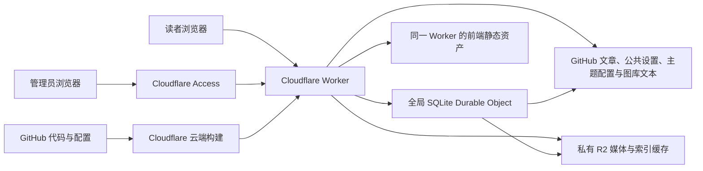

# 架构与工作流程

维护前阅读 [平台守则](PLATFORM.md) 和 [主题协议](THEMES.md)：文本配置写 GitHub，媒体资源写 R2；公共资料、社交链接和友链统一管理；主题自行定义专属配置与前台/后台实现。

## 组件

没有常驻服务器、用户数据库或本地托管进程。Worker 是本项目的云端后端；R2 和 GitHub 由 Worker 访问。

公开博客与后台使用同一个域名。前端文件由 ASSETS binding 返回；API 请求、后台页面、媒体请求都先经过 Worker。这个顺序确保即使后台有对应的静态 HTML，也要先鉴权。

## 保存一篇文章

1. 编辑器通过上传接口创建媒体上传会话。
2. 小文件上传一次；大文件按服务器返回的分片大小逐片上传，再完成会话。
3. Worker 把媒体字节、上传会话和完整性记录写入私有 R2，返回稳定的媒体 URL。
4. 编辑器将已完成 ID幂等登记到 GitHub 图库的文章插图分类，再用 URL替换正文中的本地图片/音视频。
5. 编辑器 PUT 文章内容、状态和旧 SHA。
6. Worker 验证登录身份、Origin、字段和媒体引用，生成 YAML front matter + Markdown，提交到 `content/posts/<slug>.md`。
7. 返回新 SHA 和 GitHub commit SHA，编辑器更新本地版本。
8. 发布后的文章从公开 API 可读，已发布文章引用的媒体从公开 URL 可读。

上传和文章提交是两次独立操作。上传成功但保存失败时，继续使用已返回的媒体 id/URL 重试保存，无需重新上传。未引用的上传文件可以由管理员手动删除。

GitHub 是文章的权威存储。每次列表与公开媒体授权先读取当前分支 HEAD，再读取该 commit 的 R2 索引缓存；默认 30 秒只限制同一 commit 缓存的年龄。新提交与撤回发布不会继续读取旧 commit 缓存。GET 单篇管理文章直接获取最新文件 SHA。

## 草稿和公开媒体

R2 桶不打开公共访问，也不配置可绕过 Worker 的公共对象域名。固定文章链接采用本博客域名下 `/media/<id>/<filename>`，由 Worker 判断已发布文章引用、有效公共/启用主题配置引用或显式图库公开状态。

- 未发布文章不出现在公开列表，也不能通过公开单篇 API 读取。
- 草稿媒体通过 `/api/admin/media/<id>/file` 登录预览；文章仍保存稳定的 `/media/...` URL。
- 文章发布后，它引用的媒体可以公开读取。
- 只有草稿引用且无其他公开授权时，公开媒体 URL 返回 404。
- 只要还有任意文章（含草稿）或公共/主题配置（含停用主题）引用媒体，管理员删除媒体返回 409，先解除引用。

不要把后台预览地址、对象存储 key 或临时鉴权参数当作正文永久链接。视频使用同样的 R2 文件模型，公开读取支持 Range，前端可用原生 video 播放；这里没有视频转码、HLS 或缩略图生成服务。

如果 GitHub 仓库本身是公开的，访问 GitHub 的人可以直接读到草稿 Markdown。需要草稿正文保密时，把仓库设为私有；博客公开 API 仍可仅输出已发布内容。

## 跨服务写入协调

文章 PUT/DELETE 与媒体 DELETE 经过同一个全局 Durable Object 串行协调，避免两个请求分别操作 GitHub 与 R2 时，出现“文章刚引用媒体、另一个请求同时删除媒体”的情况。SHA 冲突检查仍然保留，协调器不会代替编辑内容合并。

绑定为 MUTATIONS → BlogMutations，wrangler.jsonc 的 exports 声明 BlogMutations 为 durable-object、storage 为 sqlite；Wrangler 在部署时管理该导出的生命周期，使用[官方声明式 exports 配置](https://developers.cloudflare.com/durable-objects/reference/durable-objects-migrations/)。无需前端知道这个对象，也不新增 HTTP 接口。缺少绑定时写操作返回 503 COORDINATOR_NOT_CONFIGURED。

这是跨请求的顺序控制，不把 GitHub 与 R2 变成一个原子数据库事务。外部服务失败仍需保留编辑状态并重试。

直接在 GitHub 网页或 git 提交里改文章不会经过这个队列。手改时需维护 YAML front matter 的 mediaIds；只在正文加入媒体链接不自动更新该数组，公开媒体授权依赖它。不要同时通过 GitHub 直改引用和后台删除相关媒体；需要协调保护时使用文章 API。

## 权限链

1. Access 的 Allow policy 只允许配置的具体管理员邮箱登录。
2. Access 将应用 JWT 交给 Worker；Worker 验证签名、iss、aud、exp，并核对 `ADMIN_EMAILS`。
3. 写接口还要求请求 Origin 等于 `SITE_ORIGIN`，避免跨站页面利用登录 Cookie 触发保存或删除。
4. Worker 用 Secret 中的 GitHub PAT 写入唯一的配置仓库/分支/文章目录。
5. Worker 用 R2 binding 访问指定私有桶。

GitHub PAT 不到浏览器，R2 不需要暴露 S3 密钥。Access 在边缘拦截请求，Worker 的 JWT 验证继续保护可能未经过 Access 的域名或预览入口。

本地开发的 Bearer 令牌只在 `APP_ENV=development` 且 localhost/回环地址使用；生产配置不会接受它。

## 发布代码与文章

前端源码或 Worker 代码提交后，Cloudflare Workers Builds 拉取同一仓库，调用 deploy:cloudflare。wrapper 同步资源，显式执行 scripts/build.mjs 读取 mob.config.json 产出静态资源，再执行 wrangler deploy --no-build，最后同步 Builds 自身的声明。

文章接口直接在运行时读取 GitHub，因此新文章不依赖前端重新构建才可阅读。Workers Builds 可能也会因文章 commit 触发构建，这是部署触发配置决定的，不改变文章 API 的数据路径。

## 主题配置与图库文本

公共资料、导航、社交和友链放在 config/site/settings.json。各主题自己声明 config 文档和 UI；SettingsService 只按安全路径、SHA、可选 Schema与媒体引用处理。配置与 references 侧文件使用同一个 Git tree/commit，并通过非强制 ref 更新防止覆盖并发提交。

图库的 title/description/category/tags/isPublic/isListed 位于 GitHub content/gallery/items.json；R2记录只描述上传对象与完整性。文章/配置/图库写入和对象删除共用 Mutations 队列。上传完成后登记失败可重试，图库删除先撤销文本公开记录，再删除 R2对象。

主题路由读取已部署清单，访客通过 theme 参数与 mob-layout Cookie选择；返回 HTML使用 private/no-store 和 Vary: Cookie。配置值读取仓库最新文件；注册清单、源码、静态入口仍需部署。管理资产映射到 /admin/assets/<id>/，同时保护原始主题管理路径。
